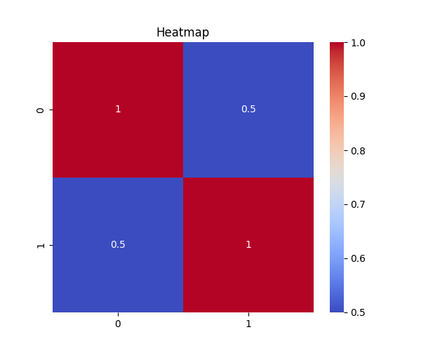
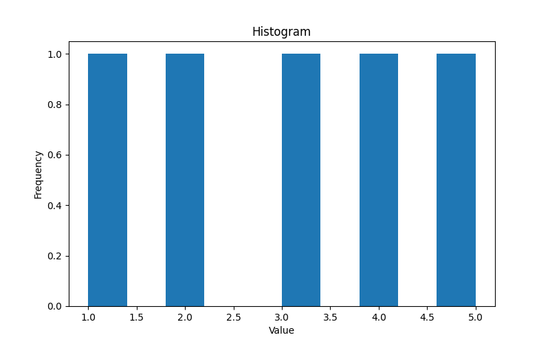
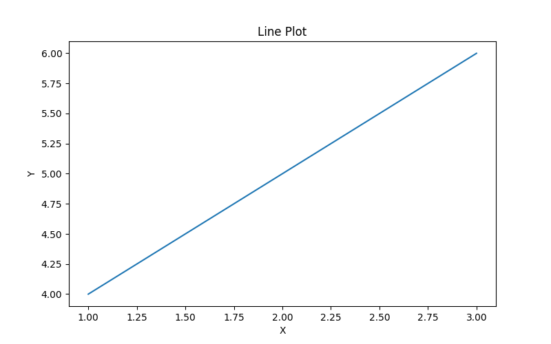

# Лабораторная работа №2  
## Основы NumPy: массивы и векторные операции

## Описание работы

В рамках лабораторной работы были изучены основные возможности библиотеки **NumPy** для работы с массивами, векторными и матричными операциями.  
Также были реализованы функции для статистического анализа данных, нормализации и визуализации результатов.

## Цель работы

Целью работы было освоение практических навыков:

- создания и преобразования массивов NumPy;
- выполнения векторных и матричных операций;
- анализа данных с помощью статистических функций;
- построения и сохранения графиков.

## Что было сделано

В ходе выполнения лабораторной работы были реализованы функции для:

- создания одномерных и двумерных массивов;
- изменения формы массива и транспонирования матрицы;
- сложения векторов, умножения на число, поэлементного умножения и скалярного произведения;
- умножения матриц, вычисления определителя, нахождения обратной матрицы и решения системы линейных уравнений;
- загрузки данных из CSV-файла;
- вычисления среднего значения, медианы, стандартного отклонения, минимума, максимума и процентилей;
- min-max нормализации данных;
- построения гистограммы, тепловой карты и линейного графика.

## Особенности реализации

Проект был разделён на несколько частей:

- `main.py` — реализация функций;
- `test.py` — тесты;
- `data/students_scores.csv` — входные данные;
- `plots/` — сохранённые графики.

Для проверки корректности использовались тесты на **pytest**.  
После исправления ошибок все тесты были успешно пройдены.

Для корректного сохранения графиков без открытия окна был использован backend `Agg` библиотеки `matplotlib`.

## Результат

В результате лабораторной работы были изучены базовые инструменты NumPy, необходимые для дальнейшей работы с анализом данных и машинным обучением.  
Все требуемые функции были реализованы, протестированы и оформлены в соответствии с основными требованиями задания.

## Полученные графики:

## Вывод

Лабораторная работа позволила закрепить навыки работы с массивами и матрицами в NumPy, познакомиться с методами статистической обработки данных и базовой визуализацией.  
Полученные знания являются важной основой для дальнейшего изучения анализа данных, численных методов и ML.

## Ссылка на проект

`https://github.com/MikhailGeras/2SEMLABY/tree/main/LR2`
